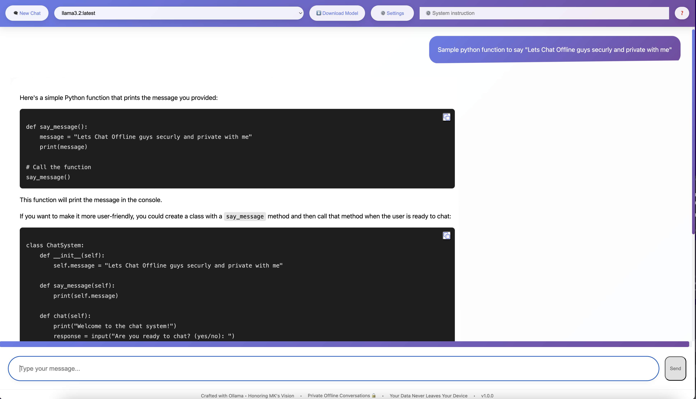

# Offline Chat Application



A private, free, offline-first chat application powered by Open Source AI models like DeepSeek, Llama, Mistral, etc. through Ollama.

## Features
- Full conversation history
- Model parameter controls
- Ollama-powered local AI processing
- Multi-LLM support (DeepSeek, Llama 2, Mistral, etc.)
- Markdown support
- System prompt engineering
- Secure offline storage
- Open source model ecosystem

## Tech Stack
**Frontend:** HTML5, CSS3, Vanilla JavaScript  
**Backend:** FastAPI, Ollama Python Client  
**AI Engine:** Ollama (Free & Open Source)  
  - Local model deployment & management  
  - Cross-platform support (Linux/macOS/Windows)  
  - Community-driven model library (Llama 2, Mistral, etc.)  
  - Efficient CPU/GPU resource utilization  
**Powered By:** DeepSeek-R1

## Supported LLM Models
**🧠 Local AI Model Library**  
Ollama supports 100+ open source models including:

| Model Family | Example Sizes | Specialization |
|--------------|---------------|----------------|
| DeepSeek     | 7B, 33B       | General purpose, coding |
| Llama 2      | 7B, 13B, 70B  | Conversational AI      |
| Mistral      | 7B, 8x7B      | Multilingual support   |
| CodeLlama    | 7B, 13B       | Code generation        |
| Phi-2        | 2.7B          | Compact reasoning      |

```bash
# Install new models via Ollama
ollama pull deepseek-r1  # 33B parameter model
ollama pull llama2:13b   # Medium-sized variant
```

## Installation

### 1. Ollama Setup
Follow platform-specific instructions:

#### macOS
```bash
curl -fsSL https://ollama.com/install.sh | sh
```
or

Download installer from [ollama.com/download/Ollama-darwin.zip](https://ollama.com/download/Ollama-darwin.zip)

#### Windows
Download installer from [ollama.com/download/OllamaSetup.exe](https://ollama.com/download/OllamaSetup.exe)

#### Linux
```bash
curl -fsSL https://ollama.com/install.sh | sh
```

### 2. Backend Dependencies
```bash
cd backend
pip install -r requirements.txt
```

### 3. Frontend Setup
```bash
cd frontend
# No installation needed - pure HTML/JS/CSS
```

## Running the Application

1. Start Ollama Service:
```bash
ollama serve
```

2. Start Backend API:
```bash
cd backend
uvicorn main:app --reload --host 0.0.0.0 --port 3000
```

3. Open Frontend:
```bash
open frontend/chat.html  # Or double-click in file explorer
```

## Project Structure
```
project-root/
├── frontend/
│   ├── chat.html        # Main interface
│   ├── app.js              # Client-side logic
│   └── styles.css          # Styling
└── backend/
    ├── main.py             # FastAPI server
    └── requirements.txt   # Python dependencies
```

## Key Code References

Frontend footer implementation:
```html:frontend/chat.html
startLine: 50
endLine: 62
```

Backend streaming logic:
```python:backend/main.py
startLine: 150
endLine: 189
```

## Acknowledgements
- Special thanks to MK for architectural guidance
- Ollama integration (Apache 2.0 License) for private AI processing
- UI design influenced by modern chat applications

## License
AGPL-3.0

---

**Powered By:** DeepSeek-R1 • Ollama (Open Source AI Platform)  
**Model Variety:** Choose from 100+ open source LLMs with sizes from 2B to 70B parameters  
**Local AI:** Full offline capability - zero cloud dependencies  
**Specialized Models:** Coding, multilingual, medical, and legal variants available
