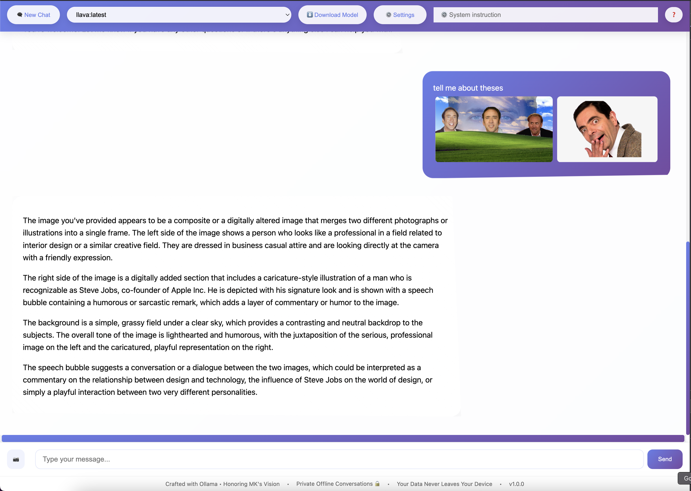
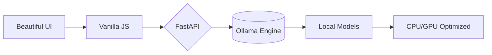
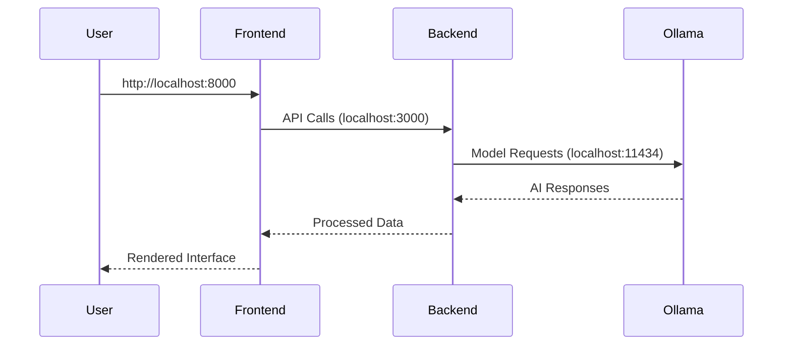

# 🚀 Next-Gen Private AI Chat - Your Data, Your Control  
*Experience the future of confidential conversations with self-hosted AI models running entirely on your device*

[](https://github.com/JKL404/Offline-Chat-Application)
[](https://opensource.org/licenses/AGPL-3.0)



A private, free, offline-first chat application powered by Open Source AI models like DeepSeek, Llama, Mistral, etc. through Ollama.

## Features
- Full conversation history
- **Image upload support** for vision models (LLaVA, Llama3.2-Vision)
- Model parameter controls
- Ollama-powered local AI processing
- Multi-LLM support (DeepSeek, Llama 2, Mistral, etc.)
- Markdown support
- System prompt engineering
- Secure offline storage
- Open source model ecosystem

## Tech Stack
**Frontend:** HTML5, CSS3, Vanilla JavaScript  
**Backend:** FastAPI, Ollama Python Client  
**AI Engine:** Ollama (Free & Open Source)  
  - Local model deployment & management  
  - Cross-platform support (Linux/macOS/Windows)  
  - Community-driven model library (Llama 2, Mistral, etc.)  
  - Efficient CPU/GPU resource utilization  
**Powered By:** DeepSeek-R1

## 🛠️ Tech Powerhouse

## 🌐 Supported Model Ecosystem
| Model Family     | Example Sizes | Specialization          |
|------------------|---------------|-------------------------|
| Vision Models    | 7B, 13B, 34B  | Image understanding     |
| DeepSeek         | 7B, 33B       | General purpose, coding |
| Llama 3          | 8B, 70B       | General reasoning       |
| LLaVA            | 7B, 13B       | Multimodal vision       |
| Llama3.2-Vision  | 8B            | Image-to-text           |

**❗ Important Note:** Image upload functionality only works with vision-capable models like:
- `llava:7b` - Large Language and Vision Assistant
- `llama3.2-vision` - Llama3-based visual understanding
- `llava-llama3` - LLaVA implementation for Llama3

**❗ System Requirements Note**  
⚠️ **Memory Requirements for Local AI:**  
- 7B models: Minimum 8GB RAM (16GB recommended)  
- 13B models: Minimum 16GB RAM (32GB recommended)  
- 33B+ models: 32GB+ RAM required  
*Note: Insufficient memory may cause slow performance or model failures*

## Installation

### 1. Ollama Setup
Follow platform-specific instructions:

#### macOS
```bash
curl -fsSL https://ollama.com/install.sh | sh
```
or

Download installer from [ollama.com/download/Ollama-darwin.zip](https://ollama.com/download/Ollama-darwin.zip)

#### Windows
Download installer from [ollama.com/download/OllamaSetup.exe](https://ollama.com/download/OllamaSetup.exe)

#### Linux
```bash
curl -fsSL https://ollama.ai/install.sh | sh
```

### 2. Backend Setup
2.1. Start Ollama Service:
```bash
ollama serve

# Optional: Pull models - for faster startup. Note You can also download models from chat.html
ollama pull deepseek-r1  # 33B parameter model
ollama pull llama2:13b   # Medium-sized variant
ollama pull llava:7b        # 7B parameter vision model
ollama pull llama3.2-vision    # Official Llama3 vision variant
ollama pull llava-llama3:8b    # Llama3-based LLaVA implementation
```

2.2. Install Python Dependencies:
```bash
pip install -r backend/requirements.txt
```
2.3. Start FastAPI Server:
```bash
uvicorn main:app --reload --port 3000
```

### 3. Frontend Setup (Required for Offline Use)
```bash
# Navigate to frontend directory
cd frontend

# Serve via local HTTP server on port 8000
python3 -m http.server 8000 --bind 127.0.0.1

# Now access at: http://localhost:8000/chat.html
```
[localhost:8000/chat.html](http://localhost:8000/chat.html)


### 4. Alternative Access Methods
| Method | Command | When to Use |
|--------|---------|-------------|
| **Local Server** (Recommended) | `python3 -m http.server 8000` | Offline access |
| **Direct File** | `open chat.html` | (Requires Internet Access in case of file access) |

**❗ Critical Offline Note:**  
For complete offline functionality:
1. First download models while online using the interface
2. All services must run on localhost:
   - Ollama: `ollama serve`
   - Backend: `uvicorn main:app --port 3000`
   - Frontend: `python3 -m http.server 8000`
3. Access via `http://localhost:8000/chat.html` never `file://`

## Running Full Stack


## Project Structure
```
project-root/
├── frontend/
│   ├── chat.html        # Main interface
│   ├── app.js              # Client-side logic
│   └── styles.css          # Styling
└── backend/
    ├── main.py             # FastAPI server
    └── requirements.txt   # Python dependencies
```

---

**📜 Full Documentation**  
Explore our [API Doc](https://github.com/JKL404/Offline-Chat-Application/blob/main/backend/README.md) for:
- Advanced model configurations
- Vision pipeline architecture
- Local deployment guides
- Plugin development tutorials

## Image Support Details
- 📸 Multi-image conversations (JPG/PNG/WEBP)  
- 🔍 Zoomable previews with pinch-to-zoom  
- 🧠 Vision model integration  
- 📦 Local image processing (no cloud uploads)  

**⚠️ Important:** Image understanding requires vision-capable models like: `llava:7b`, `llama3.2-vision`, `llava-llama3:8b`

**Capabilities:**
- Upload multiple images per message (JPG/PNG)
- Images are processed locally using vision models
- Combined text+image understanding
- Image previews with zoom functionality

**Requirements:**
1. Must use a vision-capable model
2. Images under 5MB recommended
3. Supported formats: JPEG, PNG, WEBP

**Disclaimer:**  
⚠️ Standard language models (non-vision) will ignore attached images.  
🔍 Vision capabilities require specific model architectures - regular LLMs cannot process images even if attached.

## Acknowledgements
- Special thanks to MK.
- Ollama integration (Apache 2.0 License) for private AI processing
- UI design influenced by modern chat applications

## 💡 Ethical AI Note
*We champion responsible AI - all models are open-source and locally hosted.  
No hidden trackers, no data harvesting, just pure AI innovation.*

## License
AGPL-3.0

---

**🔗 Powered By**  
[Ollama](https://ollama.ai) • [DeepSeek-R1](https://deepseek.com) • [FastAPI](https://fastapi.tiangolo.com)

## Port Configuration Reference
| Service       | Port  | Purpose                      |
|---------------|-------|------------------------------|
| **Frontend**  | 8000  | Web interface                |
| **Backend**   | 3000  | FastAPI server               | 
| **Ollama**    | 11434 | Model inference & management |
